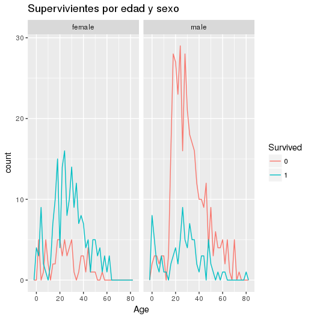
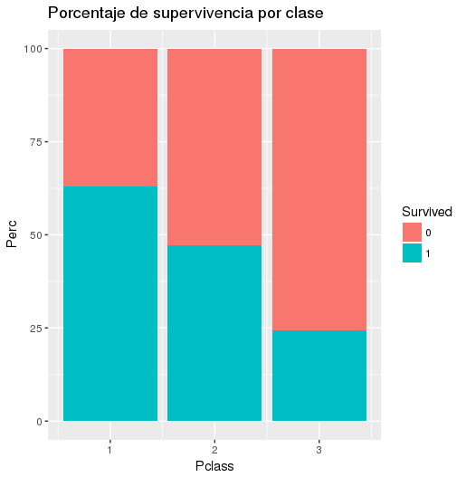
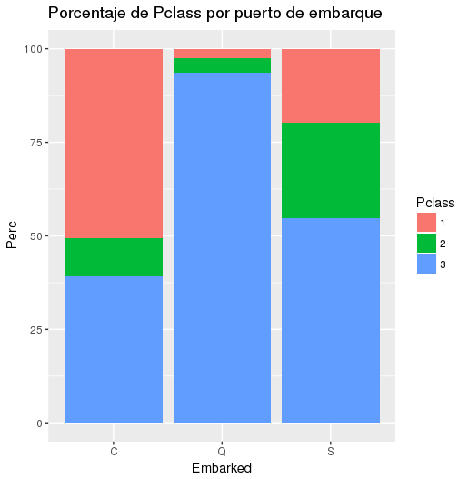
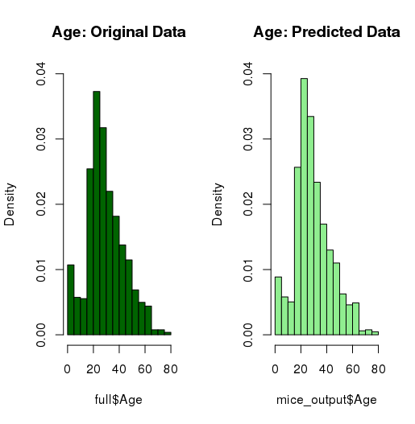
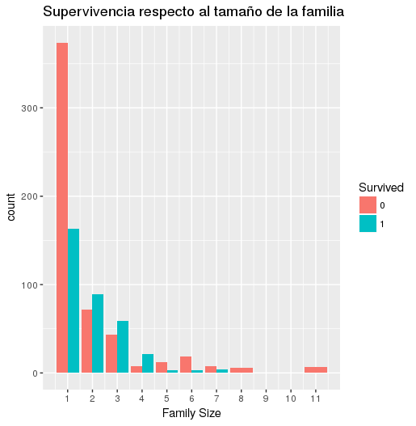
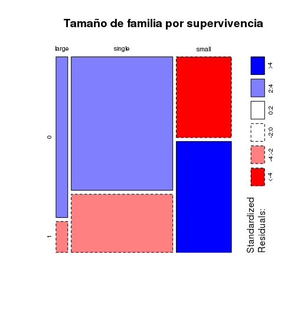
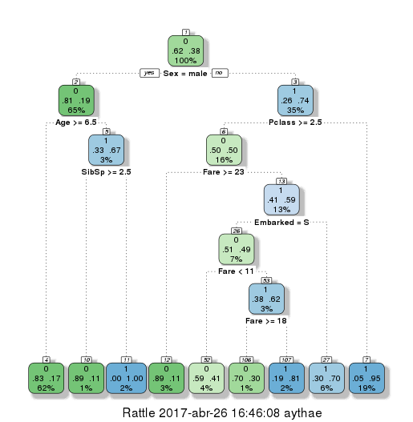
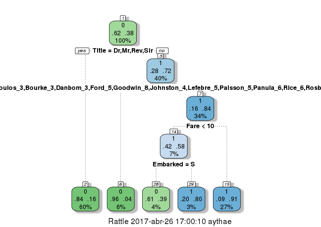
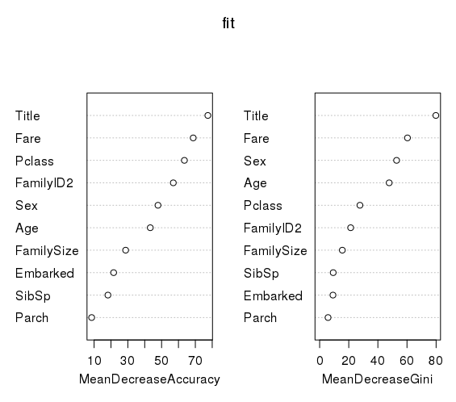
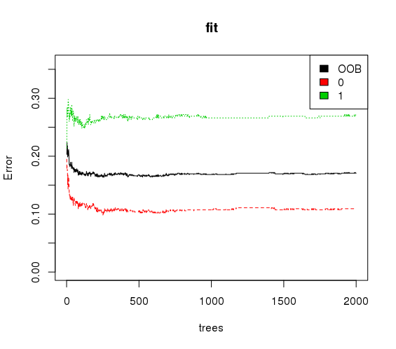

<!--Portada-->

<div class="portada">


# Práctica 1
# Competición en Kaggle sobre Clasificación Binaria
*****


<div class="portada-middle">

## Nombre del equipo: **AythaE**
## Ranking: **452** Puntuación: **0.8134**
</br>

### Sistemas Inteligentes para la Gestión en la Empresa
### Máster en Ingeniería Informática
### Curso 2016/17
### Universidad de Granada

</div>

> Nombre: Aythami Estévez Olivas
> Email: <aythae@correo.ugr.es>

</div>

<!-- Salto de página -->
<div style="page-break-before: always;"></div>

## Índice

<!--
Ejemplo de Indice final eliminando el enlace y añadiendo el número de página
- Apartado 1 <span style='float:right'>2</span>
-->

<!-- toc -->

- [1. Exploración de datos](#1-exploracion-de-datos)
  * [1.1. Las mujeres y los niños primero](#11-las-mujeres-y-los-ninos-primero)
  * [1.2. Clase social](#12-clase-social)
  * [1.3. Uniendo ambos criterios](#13-uniendo-ambos-criterios)
  * [1.4. Otras variables](#14-otras-variables)
- [2. Preprocesamiento de datos](#2-preprocesamiento-de-datos)
  * [2.1. Integración y detección de conflictos e inconsistencias en los datos](#21-integracion-y-deteccion-de-conflictos-e-inconsistencias-en-los-datos)
  * [2.2. Transformaciones](#22-transformaciones)
  * [2.3. Reducción de datos](#23-reduccion-de-datos)
- [3. Técnicas de clasificación](#3-tecnicas-de-clasificacion)
  * [3.1. Árbol de decisión simple](#31-arbol-de-decision-simple)
  * [3.2. Random Forest](#32-random-forest)
  * [3.3. CForest](#33-cforest)
- [4. Presentación y discusión de resultados](#4-presentacion-y-discusion-de-resultados)
- [5. Conclusiones y trabajos futuros](#5-conclusiones-y-trabajos-futuros)
- [6. Listado de soluciones](#6-listado-de-soluciones)
- [Bibliografía](#bibliografia)

<!-- tocstop -->

<!-- Salto de página -->
<div style="page-break-before: always;"></div>

## 1. Exploración de datos
Una vez cargados los dataset en R lo primero es comprobar que variables contienen, para ello se puede utilizar la función `str(dataset)` que nos da una descripción de la estructura interna de este
```
> str(train)
'data.frame':	891 obs. of  12 variables:
 $ PassengerId: int  1 2 3 4 5 6 7 8 9 10 ...
 $ Survived   : int  0 1 1 1 0 0 0 0 1 1 ...
 $ Pclass     : int  3 1 3 1 3 3 1 3 3 2 ...
 $ Name       : Factor w/ 891 levels "Abbing, Mr. Anthony",..: 109 191 358 277 16 559 520 629 416 581 ...
 $ Sex        : Factor w/ 2 levels "female","male": 2 1 1 1 2 2 2 2 1 1 ...
 $ Age        : num  22 38 26 35 35 NA 54 2 27 14 ...
 $ SibSp      : int  1 1 0 1 0 0 0 3 0 1 ...
 $ Parch      : int  0 0 0 0 0 0 0 1 2 0 ...
 $ Ticket     : Factor w/ 681 levels "110152","110413",..: 525 596 662 50 473 276 86 396 345 133 ...
 $ Fare       : num  7.25 71.28 7.92 53.1 8.05 ...
 $ Cabin      : Factor w/ 148 levels "","A10","A14",..: 1 83 1 57 1 1 131 1 1 1 ...
 $ Embarked   : Factor w/ 4 levels "","C","Q","S": 4 2 4 4 4 3 4 4 4 2 ...
```

Si buscamos la información proporcionada por Kaggle [1] de lo que significa cada variable nos encontramos ante la siguiente tabla

Variable    | Descripción
------------|-------------------------------------
PassengerID | Identificador del pasajero
Survived    | Sobrevivió (1) o murió (0)
Pclass      | Clase del pasaje
Name        | Nombre del pasajero y título
Sex         | Sexo del pasajero
Age         | Edad del pasajero
SibSp       | Número de esposas o hermanos a bordo
Parch       | Número de padres o hijos a bordo
Ticket      | Número del pasaje
Fare        | Tarifa del pasaje
Cabin       | Cabina
Embarked    | Puerto de embarque

El problema a resolver es predecir el valor de la variable "Survived", en un primer análisis de la distribución de valores de esta variable se observa que solo se salvaron el 38,38% de los pasajeros.

```
> prop.table(table(train$Survived))

        0         1
0.6161616 0.3838384
```
Por ello siguiendo [2] como modelo inicial se puede predecir que todos mueren con lo que se consigue un porcentaje de acierto sobre test de 62,679% lo que cuadra con las observaciones realizadas sobre el conjunto de entrenamiento.

### 1.1. Las mujeres y los niños primero
En la sabiduría popular es famosa la frase "Las mujeres y los niños primero" así que resulta lógico buscar como se relacionan la edad y el sexo con las tasas de supervivencia. Si vemos la supervivencia entre hombres y mujeres vemos que es muy diferente salvándose muchas más mujeres:
```
> prop.table(table(train$Sex, train$Survived),1)

                 0         1
  female 0.2579618 0.7420382
  male   0.8110919 0.1889081
```

Esto hace que podamos refinar el modelo inicial prediciendo que todas las mujeres sobrevivirán y que todos los hombres perecerán con lo que se consigue una tasa de acierto del 76,55% sobre test.

Si consideramos como niños a los menores de 18 años, podemos comprobar al cotejar esta variable "Child" con el sexo y la tasa de supervivencia se observa que en el caso de los hombres tienen unas tasas de supervivencia mucho más altas.
```
> aggregate(Survived ~ Child + Sex, data=train, FUN=function(x) {sum(x)/length(x)})
  Child    Sex  Survived
1     0 female 0.7528958
2     1 female 0.6909091
3     0   male 0.1657033
4     1   male 0.3965517
```

A modo de resumen de esto veáse la siguiente gráfica


Por todo ello se deduce que la edad y el sexo tendrán un papel determinante en la supervivencia, habrá que tratar la edad ya que contiene 177 valores perdidos (cerca del 20%).

### 1.2. Clase social
Otro factor que en principio podría ser determinante es la clase social ya que existían profundas diferencias en el pasaje del Titanic. Esto puede venir representado en la clase del billete (variable `Pclass`) o en el precio de este (`Fare`). Si comenzamos analizando la clase del pasaje se observa que obviamente existen muchos menos billetes de 1ª y 2ª clase que de 3ª. Analizando el porcentaje de supervivencia se puede apreciar en la siguiente gráfica como los pasajeros de las clases elevadas tenían más del doble del porcentaje de supervivencia que los de clase 3.



Si pasamos a analizar el precio del pasaje se observan profundas diferencias con precios por debajo de 10 hasta los 500. Al ser un atributo continuo con una gran cantidad de valores lo discretizo en 4 valores: <10, 10-20, 20-30, 30+. Una vez hecho esto analizamos los porcentajes de supervivencia observando como se incrementan las posibilidades de sobrevivir cuando más se haya pagado por el pasaje, lo que cuadra con las observaciones realizadas sobre la variable `Pclass`.
```
> prop.table(table(train$FareDiscrete, train$Survived),1)

                0         1
  <10   0.8005952 0.1994048
  10-20 0.5754190 0.4245810
  20-30 0.5735294 0.4264706
  30+   0.4125000 0.5875000
```

### 1.3. Uniendo ambos criterios
Si representamos las tasas de supervivencia respecto al sexo, la clase del pasaje y el dinero pagado por este obtenemos la siguiente tabla de la que cabe destacar las filas 8 y 9 (destacadas con ##) las cuales rompen la tendencia en las mujeres que establece que todas sobreviven, si son de 3ª clase y han pagado más de 20 por su pasaje tienen unas altas probabilidades de morir.

```
> aggregate(Survived ~ FareDiscrete + Pclass + Sex, data=train, FUN=function(x) {sum(x)/length(x)})
   FareDiscrete Pclass    Sex  Survived
1         20-30      1 female 0.8333333
2           30+      1 female 0.9772727
3         10-20      2 female 0.9142857
4         20-30      2 female 0.9000000
5           30+      2 female 1.0000000
6           <10      3 female 0.5937500
7         10-20      3 female 0.5813953
8         20-30      3 female 0.3333333 ##
9           30+      3 female 0.1250000 ##
10          <10      1   male 0.0000000
11        20-30      1   male 0.4000000
12          30+      1   male 0.3837209
13          <10      2   male 0.0000000
14        10-20      2   male 0.1587302
15        20-30      2   male 0.1600000
16          30+      2   male 0.2142857
17          <10      3   male 0.1115385
18        10-20      3   male 0.2368421
19        20-30      3   male 0.1250000
20          30+      3   male 0.2400000
```
Si asumimos que este comportamiento se dará también en el conjunto de test llegamos a crear un modelo con un 77,99% de acierto.

Si además de esto añadimos la variable `Child`, que recordemos es una variable binaria con valor 1 para los menores de 18 años, llegamos a la siguiente tabla. A las conclusiones previas podemos añadir que los niños masculinos se salvan en su mayoría con la excepción de los de clase 3 que han pagado menos de 10 o más de 20
```
> aggregate(Survived ~ FareDiscrete + Pclass + Child+ Sex, data=train, FUN=function(x) {sum(x)/length(x)})
   FareDiscrete Pclass Child    Sex   Survived
1         20-30      1     0 female 0.83333333
2           30+      1     0 female 0.98750000
3         10-20      2     0 female 0.90625000
4         20-30      2     0 female 0.88000000
5           30+      2     0 female 1.00000000
6           <10      3     0 female 0.56140351
7         10-20      3     0 female 0.50000000
8         20-30      3     0 female 0.40000000
9           30+      3     0 female 0.11111111
10          30+      1     1 female 0.87500000
11        10-20      2     1 female 1.00000000
12        20-30      2     1 female 1.00000000
13          30+      2     1 female 1.00000000
14          <10      3     1 female 0.85714286
15        10-20      3     1 female 0.73333333
16        20-30      3     1 female 0.16666667
17          30+      3     1 female 0.14285714
18          <10      1     0   male 0.00000000
19        20-30      1     0   male 0.40000000
20          30+      1     0   male 0.35365854
21          <10      2     0   male 0.00000000
22        10-20      2     0   male 0.11864407
23        20-30      2     0   male 0.04761905
24          30+      2     0   male 0.00000000
25          <10      3     0   male 0.10931174
26        10-20      3     0   male 0.12903226
27        20-30      3     0   male 0.07142857
28          30+      3     0   male 0.41666667
29          30+      1     1   male 1.00000000
30        10-20      2     1   male 0.75000000
31        20-30      2     1   male 0.75000000
32          30+      2     1   male 1.00000000
33          <10      3     1   male 0.15384615 ##
34        10-20      3     1   male 0.71428571
35        20-30      3     1   male 0.20000000 ##
36          30+      3     1   male 0.07692308 ##
```
Con esto podemos construir otro modelo que obtiene la misma puntuación que el previo por lo que probablemente las conclusiones extraídas sobre el conjunto de entrenamiento no sean directamente aplicables por ser demasiado adaptadas a este, encontrándonoos ante un problema de "sobreentrenamiento".

<!-- Salto de página -->
<div style="page-break-before: always;"></div>

### 1.4. Otras variables
La variable `PassengerID` corresponde a un identificador único del pasajero por lo que no aportaría nada a predecir su supervivencia o no. Respecto al atributo `Name` en principio podría parecer que nos encontramos ante un caso similar, pero este no solo contiene el nombre del pasajero si no su titulo social (Mr para hombre casado, Master para soltero,...) y esta demuestra ser una información muy importante como comentaré en el siguiente apartado. Por acabar con los atributos de identificación el atributo `Ticket` corresponde a un identificador del billete por lo que no lo usaré por idénticos motivos.

Los atributos `SibSp` y `Parch` dan una idea del tamaño de la familia que se encuentra a bordo del barco lo cual puede ser útil para determinan la supervivencia o no de las diferentes familias como se explicará en el siguiente apartado.

El atributo `Cabin` podría ser interesante conociendo la posición de los camarotes del barco pero tiene un total de 687 valores perdidos de 891 lo que imposibilita usarlo en la práctica.

El atributo `Embarked` podría ser interesante a priori si observamos los porcentajes de supervivencia donde Cherbourg destaca por encima de todos, mencionar que la primer fila corresponde a 2 valores perdidos de este atributo.
```
> prop.table(table(train$Embarked, train$Survived),1)

            0         1
    0.0000000 1.0000000
  C 0.4464286 0.5535714
  Q 0.6103896 0.3896104
  S 0.6630435 0.3369565
```
Que los pasajeros que han embarcado en una localización tengan más probabilidades de sobrevivir no parece tener sentido, sin embargo si analizamos la distribución de clases de los pasajeros embarcados en un lugar u otro nos encontramos que algo más de la mitad de los pasajeros que embarcaron en Cherbourg pertenecen a la 1ª clase lo que podría explicar su mayor tasa de supervivencia [3].




## 2. Preprocesamiento de datos
La realización de este preprocesamiento se ha llevado a cabo a la par en los datasets `train` y `test` por lo que por comodidad los he unido en un único dataset `full` del siguiente modo
```
test$Survived <- NA
full <- rbind(train, test)
```
### 2.1. Integración y detección de conflictos e inconsistencias en los datos

Como ya he comentado en el apartado previo existen diversas variables con valores perdidos, he tratado solo algunas de ellas, ya que otras como `Cabin` tienen un número tan elevado de valores perdidos que resulta muy complicado utilizarlas ya que hay que tener cuidado con las imputaciones porque siempre que las realizamos estamos variando los datos originales y podemos llegar a crear modelos con los datos artificiales que funcionen muy bien, pero que no se se adapten a los datos reales que al final es el objetivo.

Como he concluido en el análisis exploratorio la **edad** parece ser un factor determinante para predecir la supervivencia, también como he comentado tiene cerca del 20% de valores perdidos, por lo que una imputación podría mejorar sustancialmente la calidad de los modelos construidos. Para realizar esta imputación he probado dos técnicas distintas:

- **Árbol de regresión**: usando el paquete `rpart` y su método homónimo con el método "anova" he predicho los valores perdidos usando las variables `Pclass`, `Sex`, `SibSp`, `Parch`, `Fare`, `Embarked`, `Title` y `FamilySize`. En la siguiente gráfica se puede observar la distribución de frecuencias relativas de la edad antes y después de imputar.


- **Utilizando el paquete `mice`**: Usando dicho paquete con el método random forest a partir de las variables `Pclass`, `Sex`, `Age`, `SibSp`, `Parch`, `Fare`, `Embarked`, `Tittle` y `FamilySize`. En la siguiente gráfica se observa la distribución de frecuencias con este método.



A pesar de que el método mice obtiene una distribución de frecuencias más similar, lo que indica que la imputación ha variado menos los datos originales, he obtenido mis mejores resultados con el árbol de regresión. Hay que tomar esta conclusión con cautela ya que no he realizado una comparación directa con el resto de parámetros iguales, si no que he creado modelos distintos modificando su preprocesamiento e imputación. Por lo que he obtenido mejores resultado con la combinación de preprocesamiento e imputación con árbol.

Otra variable con valores perdidos que he tratado ha sido **`Embarked`**, esta tiene únicamente 2 valores perdidos, por lo que no tiene mucho sentido montar un modelo predictivo para dos valores. Por simplicidad he decidido darles el valor "S" (Southampton) ya que es el más numeroso de los tres.

Siguiendo la tendencia de esta variable he tratado también **`Fare`** la cual tiene 1 valor perdido, para librarme de él le he asignado la mediana de esta variable.

### 2.2. Transformaciones
En este campo es donde he realizado más trabajo de preprocesamiento, como ya he adelantado resulta muy destacada la generación de la variable **`Title`** con el título social de los individuos a partir de los datos del nombre. Descomponiendo estos por "," y "." y seleccionando el segundo elemento que corresponde al título. Si observamos la distribución de títulos vemos que claramente hay algunos muy numerosos como `Mr` de hombre casado, `Miss` de mujer soltera... mientras otros que apenas tienen unas pocas apariciones. Estos últimos son títulos más distinguidos como el capitán del barco, una condesa o algunos rangos militares. Con el fin de usar esta variable de una manera más cómoda he discretizado esta variable como describiré en el apartado venidero.

Como ya he indicado en el análisis exploratorio los campos `Parch` y `SibSp` nos dan una idea del tamaño de la familia que viajaba junta en el barco, por ello he decidido combinar la información de ambos creando la variable **`FamilySize`** calculada como `Parch` + `SibSp` + 1 para contar al mismo pasajero. Si observamos la supervivencia respecto a esta variable.



Se aprecia que existe cierta ventaja para las familias de entre 2 y 4 miembros a la hora de sobrevivir, por lo que este campo probablemente sea útil para predecir la supervivencia. Para recoger esta ventaja he probado discretizando esta variable como comentaré a continuación.

Usando esta recién creada variable me planteé si se podría observar alguna ventaja en la supervivencia de familias enteras, es decir si los miembros de una misma tenían más posibilidades de salvarse o morir todos juntos. Para ello he creado la variable **`FamilyID`** a partir del apellido y el numero de miembros de la familia. Esto tiene ciertos problemas ya que los apellidos se podrían repetir o no tiene sentido crear un FamilyID para personas que viajen en solitario. Partiendo de la hipótesis de que puede suponer una ventaja/desventaja viajar en una familia, esta se materializará más en una familia con algunos hijos así que descartaré todas las familias con menos de 2 miembros dándoles el valor "Small" para esta variable. Esto unido a que concateno el tamaño de familia al apellido hace complicado que existan 2 familias con igual apellido e idénticos miembros a bordo del barco, con lo que resolvería el problema de los apellidos iguales.

### 2.3. Reducción de datos

Como comentaba he discretizado la variable **título**, con el siguiente comando de R podemos apreciar la distribución de valores de dicha variable
```
> table(full$Title)

        Capt          Col          Don         Dona           Dr     Jonkheer
           1            4            1            1            8            1
        Lady        Major       Master         Miss         Mlle          Mme
           1            2           61          260            2            1
          Mr          Mrs           Ms          Rev          Sir the Countess
         757          197            2            8            1            1
```

Se aprecia que hay algunas muy poco numerosas que podrían derivar en problemas de sobreaprendizaje al crear modelos a partir de estos datos, por ello reduciré sus valores. Los títulos más distinguidos son aquellos que tienen un menor número de apariciones, por ello he agrupado los titulós distinguidos masculinos ('Capt', 'Don', 'Major', 'Sir') en el valor 'Sir' y los femeninos ('Dona', 'Lady', 'the Countess', 'Jonkheer') en el valor 'Lady'. Respecto a otros valores poco frecuentes pero que no indican distinción como 'Mlle' (mademoiselle en francés), 'Ms' o 'Mme' (madame en fracés) he probado dos agrupaciones según se aconseja en [2] y [4]. En el primer caso he agrupado 'Mme' y 'Mlle' en 'Mlle' por considerarlo equivalente, mientras que en el segundo he asociado 'Ms' y 'Mlle' con 'Miss' haciendo lo propio con 'Mme' al sustituirlo por 'Mrs'. He obtenido mejores resultados con el primer enfoque, pero una vez más nos los comparado en igualdad de condiciones, por lo que no se pueden tomar mis conclusiones al pie de la letra.

Tambíen es posible discretizar el **tamaño de la familia** para intentar recoger esa ventaja que aprecia en las familias de 2 a 4 miembros como aconseja [4]. Para ello creo 3 grupos:
- Familia pequeña "small": las familias de entre 2 y 4 miembros.
- Familia individual "single": las personas que viajan solas.
- Familia grande "large": las familias de más de 4 miembros.

Como se aprecia en el siguiente gráfico de mosaico existen más posibilidades de sobrevivir en una familia pequeña como habíamos observado previamente.



A pesar de esto no he conseguido mejorar mis resultados con esta discretización. Por ello se me ocurrió que otra forma de reflejar estas penalizaciones de supervivencia respecto al tamaño de la familia, al menos parcialmente, era usar el atributo **`FamilyID`** cambiando el criterio de considerar a una familia pequeña de 2 miembros (que teóricamente tiene más posibilidades de sobrevivir) a 1, con lo que obtengo un número mayor de ids, pero otra vez más tampoco esto funciona como puedo esperar.

## 3. Técnicas de clasificación
Antes de comentar las técnicas de clasificación utilizadas comentar que antes de usar ninguna técnica propiamente dicha he creado ciertos "modelos" iniciales como ya he ido comentando en el análisis exploratorio de datos. Estos modelos se basan en conclusiones iniciales extraídas de los datos y en principio son muy simples, pero llegan a ofrecer resultados bastante decentes de hasta un 77,99% lo que destaca la importancia del análisis exploratorio en un proceso de analítica de datos.

También a modo general las técnicas que he empleado se engloban todas dentro de los árboles de decisión. He decidido decantarme por esta familia de clasificadores contra otros porque probablemente sean uno de los modelos más usados que además permite cierta interpretabilidad contra otros clasificadores como pueden ser las redes neuronales o las SVM. Junto a esto destacar que los últimos modelos son ensembles de arboles, es decir conjuntos de arboles distintos que clasifican y llegan a un acuerdo posterior, esto hace que se resuelvan los posibles problemas de sobreaprendizaje que puede sufrir un árbol de decisión individual y permite crear un modelo más robusto.

### 3.1. Árbol de decisión simple
Primero concretaré el modelo de árbol de decisión empleado. Me he decantado por los arboles disponibles en el paquete `rpart`. He creado un árbol inicial sin preprocesamiento alguno que se construye con la siguiente sentencia.
```
> fit <- rpart(Survived ~ Pclass + Sex + Age + SibSp + Parch + Fare + Embarked,
             data=train,
             method="class")
```
Dicho modelo alcanza una puntuación de 78,469% de acierto. Como se puede apreciar no se utilizan todos los atributos para predecir, si no unos cuantos que han demostrado tener influencia en la supervivencia durante el análisis exploratorio. En la siguiente imagen podemos apreciar la forma que tiene este árbol, en verde aparecen los nodos con una mayoría que no ha sobrevivido y en ázul los que sí. Se observa que no es muy grande y que los atributos que primero aparecen (los más discriminantes) son precisamente los que he identificado en el análisis exploratorio. Contemplando esta imagen ºsale a relucir una característica fundamental de los árboles de decisión, su interpretabilidad, no resulta necesario saber como funciona internamente, simplemente viendo esta imagen cualquiera podría clasificar manualmente instancias siguiendo los pasos que se indican en cada bifurcación.



Añadiendo las variables generadas `FamilySize` sin discretizar, `Tittle` agrupado del primer modo y `FamilyID` considerando familia pequeña a aquella con menos de 2 miembros, construyo el siguiente árbol
```
fit <- rpart(Survived ~ Pclass + Sex + Age + SibSp + Parch + Fare + Embarked + Title + FamilySize + FamilyID,
             data=train,
             method="class")
```
Que llega a alcanzar el 79,426% de acierto. En la siguiente imagen aparece la representación de este árbol, en esta ocasión las variables generadas han desplazado a las iniciales por lo que podemos deducir que son más importantes para determinar si una persona sobrevive o no.



### 3.2. Random Forest
Random forest es un tipo de ensemble que comentaba antes formado por multiples árboles de decisión individuales, en concreto pertenece a los tipo bagging que se caracteriza porque los clasificadores individuales clasifican por separado y la clase final se asigna por voto mayoritario. Este es un algoritmo muy utilizado y que da baste buenos resultados, se basa en la creación de un elevado número de arboles de decisión con selección aleatoria de un pequeño número de variables para cada uno (por defecto la raíz cuadrada del número de variables) y usando muestreo con remplazamiento para la selección de items. Con esto construye árboles sin podar usando la medida de Gini para realizar las divisiones en los nodos. Esto en principio creará clasificadores individuales muy adaptados a los datos y que sufrirán de sobreentrenamiento con alta probabilidad, a priori puede parecer una desventaja, pero el hecho de tener un elevado número de arboles individuales cada uno sobreentrenado de distinta manera hace que los errores de unos se compensen los los otros.

En concreto he usado el paquete `randomForest` de R, este tiene varias limitaciones como que no funciona bien con valores perdidos, por ello elimino los valores perdidos de las variables que usaré: `Age`, `Fare` y `Embarked` como he descrito previamente. Adicionalmente es necesario reducir los valores de la variable `FamilyID` ya que el algoritmo solo puede procesar factores de hasta 32 niveles (valores distintos) y esta variable tiene casi el doble. Para ello determino que se considere familia pequeña a aquella con tres o menos miembros en lugar de dos, con esto genero una variable `FamilyID2` de 22 niveles.

Una vez preparados los datos de igual modo que con el arbol de decisión individual creo el modelo con el siguiente código especificando como parámetro que se creen 2000 árboles.
```
fit <- randomForest(as.factor(Survived) ~ Pclass + Sex + Age + SibSp + Parch + Fare + Embarked + Title + FamilySize + FamilyID2,
                    data=train,
                    importance=TRUE,
                    ntree=2000)
```

Dicho modelo obtiene una puntuación de 77,512 % lo cual es inferior a los modelos de árboles de decisión individuales. Esto puede resultar extraño pero probablemente se deba a que la capacidad de los modelos más complejos como este se demuestra cuanto más grande sea el dataset. Un modelo más potente no es siempre mejor en todos los problemas como se demuestra de este rendimiento.

Para analizar más en detalle el modelo construido aporto las siguientes gráficas:
- A la izquierda podemos observar las medidas de importancia para cada uno de los atributos:
    - _MeanDecreaseAcuracy_ determina cuanto empeoraría el modelo de media si eliminamos cada variable.
    - _MeanDecreaseGini_ implica cuando se reduciría la medida de Gini en los arboles individuales sin dicha variable
- A la derecha podemos observar la tasa de error con el número de arboles, la linea roja determina el error para predecir que un individuo muera, en verde para que sobreviva y en negro el error observado usando los items no seleccionados para construir el modelo, por lo que se predicen a modo de validación del modelo y dan una idea de como será capaz de generalizar este modelo.

Respecto a la primera gráfica los resultados no resultan sorprendentes, las variables más importantes son las que ya habíamos identificado en los árboles de decisión normales. Respecto a la segunda resulta interesante como el error para predecir que alguien ha sobrevivido es más del doble que el caso contrario, esto seguramente se deba a que nos encontramos ante un problema no balanceado donde la clase minoritaria es sobrevivir, por ello existen menos muestras y resulta más complicado predecirlas. Otra cosa curiosa de esta gráfica es que a pesar de que la validación con las observaciones Out-Of-Bag fija la tasa de error entorno al 0.17 cuando usamos los datos de test reales esta se sitúa casi en el 0.25, muy superior a la esperada.





<!-- Salto de página -->
<div style="page-break-before: always;"></div>


### 3.3. CForest
Este es un tipo de Random Forest que varía en el tipo de clasificador elemental empleando árboles de inferencia condicional o _conditional inference trees_, que toman sus decisiones usando tests estadísticos en lugar de simplemente la medida de Gini. La versión que he utilizado se encuentra en el paquete de R `party` y se construye de la siguiente forma:
```
fit <- cforest(as.factor(Survived) ~ Pclass + Sex + Age + SibSp + Parch + Fare + Embarked + Title + FamilySize + FamilyID,
               data = train,
               controls=cforest_unbiased(ntree=2000, mtry=3))
```
En esta ocasión especifico como parámetros el número de arboles (2000) y el número de variables a usar en cada árbol (3). Tambíen destacar como se puede observar que no ha sido necesario pasarle la versión reducida de la variable `FamilyID` ya que estos árboles son capaces de manejar un número mayor de factores.

Con este algoritmo he constuido diversos modelos variando el preprocesamiento aplicado


## 4. Presentación y discusión de resultados
Grafica arbol inicial.
Grafica importancia.

Comentar prueba final toqueteando parametros que no lleva a ningun lado, habria que profundizar
## 5. Conclusiones y trabajos futuros
Falta de tiempo

Xgboost pero tal cual parece dar problemas, probar tecnicas que le vayan bien como Smote

Seguir preprocesamiento de [3] y toquetear los parámetros de clasificador
<!-- Salto de página -->
<div style="page-break-before: always;"></div>

## 6. Listado de soluciones
La siguiente tabla recoge las distintas soluciones presentadas en Kaggle, tengo que mencionar inicialmente que son 11 filas en lugar de 12 a pesar de ser estos mis intentos en Kaggle. Esto se debe a que he subido la solución 3 dos veces debido a que se produjo un error durante la subida y lo volví a subir, por esto no la menciono en la tabla. Respecto a las posiciones del ranking son algo aproximadas ya que seleccionando una entrega como solución final no varia el ranking de Kaggle, por lo que he aproximado a las posiciones ocupadas por puntuaciones idénticas. Como software utilizado para todos los intentos se ha utilizado RStudio y los paquetes y funciones indicadas en la lista de abreviaturas.
La siguiente lista de abreviaturas por orden alfabético recoge los preprocesamientos y algoritmos utilizados para las distintas soluciones:
- AD1: Árbol de decisión usando el paquete y función `rpart` con el método "class" prediciendo la variable Survived usando Pclass, Sex, Age, SibSp, Parch, Fare y Embarked.
- AD2: Árbol de decisión usando el paquete y función `rpart` con el método "class" prediciendo la variable Survived usando Pclass, Sex, Age, SibSp, Parch, Fare, Embarked, Title, FamilySize y FamilyID.
- CRF: Random Forest usando como unidad elemental conditional inference trees con la función `cforest` del paquete `party`, 2000 árboles y 3 variables aleatorias a elegir en cada nodo. Predice en función de Pclass, Sex, Age, SibSp, Parch, Fare, Embarked, Title, FamilySize y FamilyID.
- CRFDS: Igual algoritmo que el previo pero creando dos modelos separados para hombres y mujeres, prediciendo hombres y mujeres por separado y luego uniendo los resultados.
- HM: Todos los hombres mueren.
- MSP3: Todas las mujeres se salvan menos las de la clase P3 que pagaron más de 20 por su billete.
- MSP3 + NHP3: Todas las mujeres se salvan menos las de la clase P3 que pagaron más de 20 por su billete y además todos los niños (menores de 18 años) hombres se salvan a expción de los de clase P3 que pagaron menos de 10 o más de 20.
- NA: Nada de preprocesamiento.
- RF: Random Forest del paquete homónimo con 2000 árboles prediciendo a partir de Pclass, Sex, Age, SibSp, Parch, Fare, Embarked, Title, FamilySize y FamilyID2 (como Family ID pero considerando familia grande las de más de 3 miembros).
- TFSFID: Extracción del título social a partir del nombre, cálculo del tamaño de la familia en función de SibSp y Parch, además de generación de un ID de familias grandes (+ de 2 miembros).
- TFSFID + IEEF: Mismo preprocesamiento que el previo pero añadiendo imputación de la edad usando un árbol de regresión Anova a partir de Pclass, Sex, SibSp, Parch, Fare, Embarked, Title y FamilySize; imputación de los datos perdidos de embarque por el puerto más numeroso ("S") y de los datos perdidos del precio del pasaje por la mediana de su distribución.
- TFSFID2 + IEEF: Igual que lo anterior pero discretizando el tamaño de familia en "single" si < 2, "small" si > 1 y < 5 y "large" si > 4.
- TFSFID3 + IEEF: Igual preprocesamiento pero agrupando los títulos de manera distinta, considerando familia grande la que tiene 2 o más miembros y realizando la imputación de la edad usando el paquete `mice` y el método `rf`.
- TM: Como "algoritmo" se asume que todos mueren.


Nº de solución | Descripción Preprocesamiento | Algoritmos y Software | % Acierto en entrenamiento | % Acierto en test | Posición del Ranking
---------------|------------------------------|-----------------------|----------------------------|-------------------|---------------------
1              | NA                           | TM                    | 61,61616                   | 62,679            | 13022 17/04
2              | NA                           | HM                    | 78,675                     | 76,555            | 7742 18/04
3              | NA                           | MSP3                  | 80,8                       | 77,99             | 4928 19/04
4              | NA                           | MSP3 + NHP3           | 82,379                     | 77,99             | 4928 19/04
5              | NA                           | AD1                   | 83,951                     | 78,469            | 3525 21/04
6              | TFSFID                       | AD2                   | 85,522                     | 79,426            | 1945 21/04
7              | TFSFID + IEEF                | RF                    | 92,817                     | 77,512            | 5997 22/04
**8**          | **TFSFID + IEEF**            | **CRF**               | **85,634**                 | **81,34**         | **452 22/04**
9              | TFSFID2 + IEEF               | CRF                   | 85,634                     | 80,383            | 819 22/04
10             | TFSFID3 + IEEF               | CRF                   | 87,205                     | 80,383            | 819 22/04
11             | TFSFID + IEEF                | CRFDS                 | 85,185                     | 81,34             | 452 22/04

<!-- Salto de página -->
<div style="page-break-before: always;"></div>

## Bibliografía

<p id="1">

[1]: Kaggle (n.d). Titanic: Machine Learning from Disaster. Recuperado el 25 de Abril de 2017, desde <https://www.kaggle.com/c/titanic/>

</p>

<p id="2">

[2]: T. Stephens (n.d). Titanic: Getting Started with R. Recuperado el 25 de Abril de 2017, desde <http://trevorstephens.com/kaggle-titanic-tutorial/getting-started-with-r/>

</p>

<p id="3">

[3]: Z. Kremonic (n.d). Titanic Random Forest: 82.78%. Recuperado el 25 de Abril de 2017, desde <https://www.kaggle.com/zlatankr/titanic/titanic-random-forest-82-78/run/806902>

</p>

<p id="4">

[4]: M.L. Risdal (2016). Exploring the Titanic Dataset. Recuperado el 25 de Abril de 2017, desde <https://www.kaggle.io/svf/924638/c05c7b2409e224c760cdfb527a8dcfc4/__results__.html>

</p>
